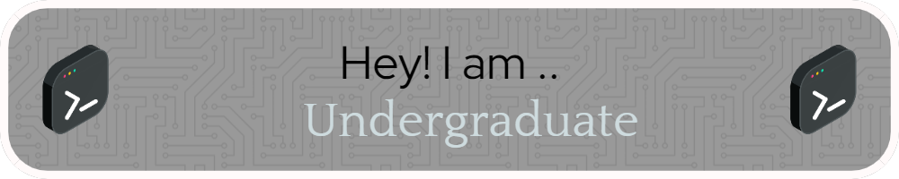

### Hi there 👋 I 'M CHAMOD DESHAN 

- 🔭 I’m currently working on Reading B.ICT.(Hons) in Information and Communication Technology degree at Uva Wellassa University of Sri Lanka.
- 🌱 I’m currently learning about various programming languages, Business Inteligence, databases, and software development methodologies.
- 👯 I’m looking to collaborate on projects related to web development, software engineering, or data analytics.
- 🤔 I’m looking for help with gaining practical experience through internships or projects.
- 💬 Ask me about my favorite programming languages, tech stacks, or IT-related topics.
- 📫 How to reach me: **chamoddeshan401@gmail.com**
- 😄 Pronouns: He/Him
- ⚡ Fun fact: I enjoy solving challenging coding problems and exploring new technologies in my free time.
